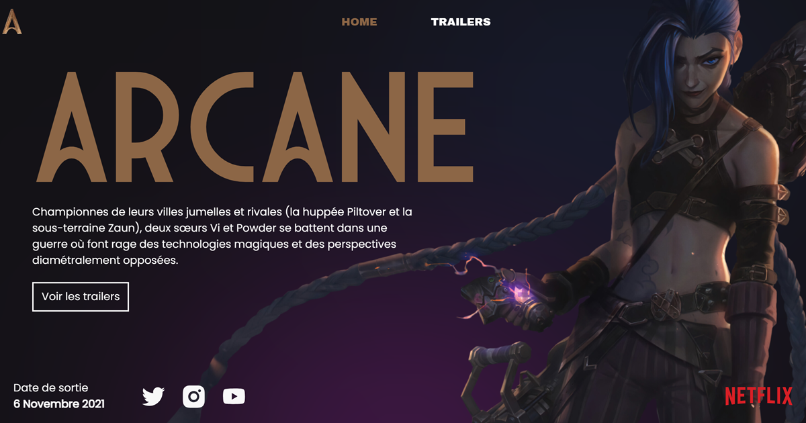

# Arcane: The Animated Series

## Overview

**Arcane** is a critically acclaimed animated series that dives into the rich universe of **League of Legends**. Developed by **Riot Games** and **Fortiche Production**, the series premiered on **Netflix** and has captivated audiences with its intricate storytelling and stunning visuals.

## Plot

Set in the contrasting cities of **Piltover** and **Zaun**, the narrative follows the tumultuous lives of two sisters, **Jinx** and **Vi**, torn apart by circumstance and ideology. As they navigate a world filled with magic and technology, their paths cross with other iconic characters like **Jayce** and **Viktor**, leading to a gripping tale of conflict and discovery.

## Trailer Highlights

The trailer for **Arcane** sets the stage for an epic saga, showcasing the series' unique art style and dynamic action sequences. It teases the complex relationship between the characters and the overarching themes of power, family, and the consequences of ambition.

## Implementation Project

The project aims to recreate the captivating essence of the **Arcane** trailer, bringing the animated world to life through an immersive experience. By implementing key scenes and elements from the trailer, fans can engage with the series in a new and interactive way.

## Visual Reference

A scene from the trailer captures the essence of **Arcane**'s storytelling:

