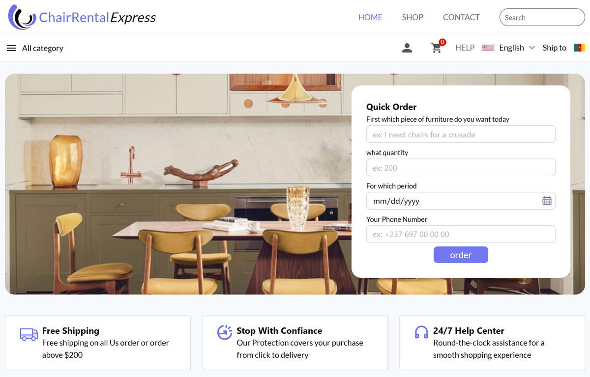
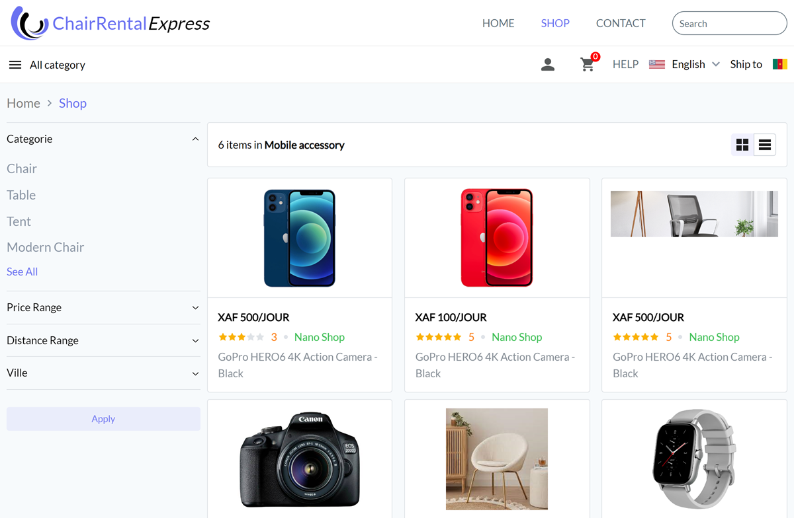

# My E-Commerce Journey: Chair-Rental

## Introduction

Embarking on the journey of creating **Chair-Rental**, an e-commerce platform dedicated to selling chairs, has been both challenging and rewarding. This venture not only served as a business endeavor but also as a learning expedition, particularly in mastering **Redux** and implementing custom **breadcrumbs**.



<hr/>



## Learning Redux

Redux became the cornerstone for managing the application's state, ensuring that the user experience was seamless and intuitive. Here's a snippet of how I integrated Redux into the project:

```javascript
import { createStore } from "redux";

// Define the initial state of the app
const initialState = {
  chairs: [],
  cart: [],
};

// Create a reducer function
function rootReducer(state = initialState, action) {
  switch (action.type) {
    case "ADD_CHAIR":
      return { ...state, chairs: [...state.chairs, action.payload] };
    case "ADD_TO_CART":
      return { ...state, cart: [...state.cart, action.payload] };
    // Add more cases as needed
    default:
      return state;
  }
}

// Create the Redux store
const store = createStore(rootReducer);

export default store;
```

## Implementing Custom Breadcrumbs

Breadcrumbs are essential for navigation, especially in an e-commerce site. They guide the user through the site hierarchy. Here's how I implemented a custom breadcrumb component:

```javascript
import React from "react";
import { Link } from "react-router-dom";

const Breadcrumbs = ({ crumbs }) => (
  <div className="breadcrumbs">
    {crumbs.map((crumb, index) => (
      <span key={index}>
        <Link to={crumb.path}>{crumb.title}</Link>
        {index < crumbs.length - 1 ? " > " : ""}
      </span>
    ))}
  </div>
);

export default Breadcrumbs;
```

## Conclusion

**Chair-Rental** has not only been a platform to connect customers with quality chairs but also a personal growth journey in web development. Through the challenges of implementing Redux and custom breadcrumbs, I've gained invaluable skills that will propel me further in my career.
