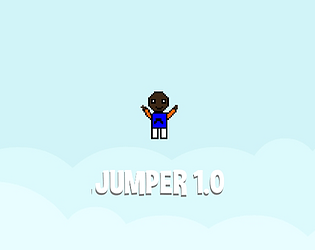
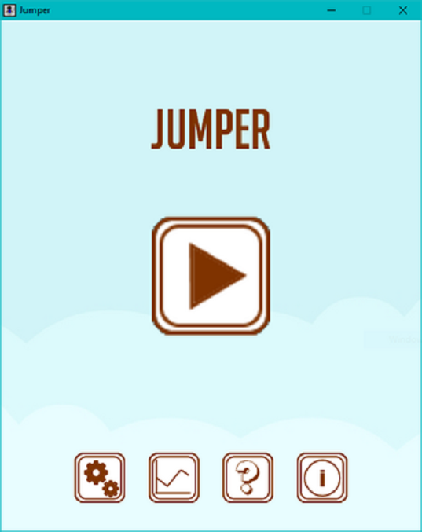
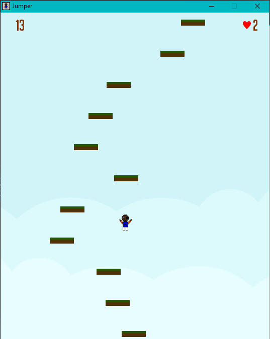

# Jumper

## Overview:

**Jumper** is not just another platformer; it's a heart-pounding journey through captivating landscapes and exhilarating challenges.

## Features:

- **Immersive Gameplay**: Engage in seamless mechanics that keep you hooked for hours.
- **Stunning Graphics**: Experience vibrant visuals that breathe life into the game world.
- **Challenging Levels**: Test your skills across a range of difficulties, from beginner-friendly to hair-pullingly tough.
- **Customizable Controls**: Tailor your control scheme to perfection for the ultimate gaming experience.

## System Requirements:

- **Operating System**: Windows
- **Processor**: Dual-core processor or better
- **Memory**: 250MB RAM
- **Graphics**: Any (minimal **DIRECTX**)
- **Storage**: **7 MB** available space

### Development:

**Jumper** is the brainchild of a relentless pursuit to master `C++` and `SDL`. Crafted with dedication and meticulous coding, this project stands as a testament to the journey of learning game development.

|                 **preview**                 |               **preview**                |
| :-----------------------------------------: | :--------------------------------------: |
|  |  |

**Get Started**:  
 Ready to leap into action? Download **Jumper** now and embark on your thrilling adventure!

<iframe frameborder="0" src="https://itch.io/embed/1761324?linkback=true&amp;border_width=4&amp;dark=true" width="100%" style="margin-bottom:30px" height="173"><a href="https://mohamedelbachir.itch.io/jumper">Jumper by mohamedelbachir</a></iframe>
