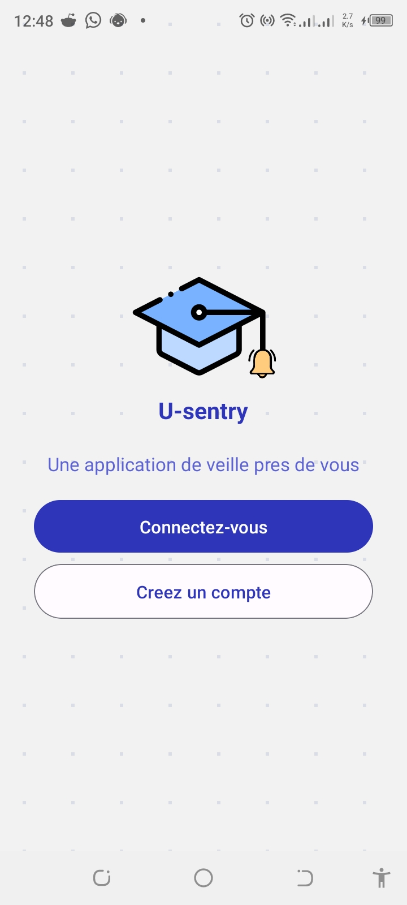
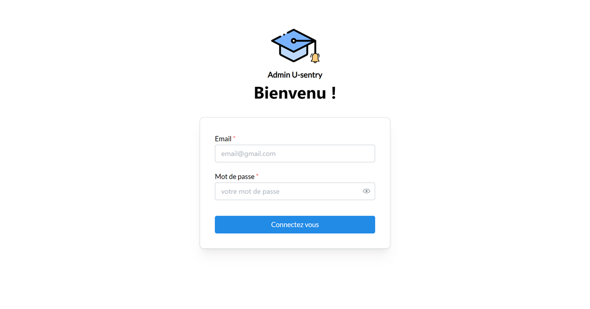

# WEB and APP: Creating U-Sentry – An Alert App and Web Dashboard

## Introduction

As part of my journey in software development, I embarked on creating **U-Sentry**, an integrated system that combines a mobile app and a web dashboard. U-Sentry serves two main purposes:

1. **Alert System**: U-Sentry provides real-time alerts to keep university communities informed about critical events, emergencies, and important announcements.
2. **News Aggregator**: The web dashboard aggregates university-related news, ensuring that users stay up-to-date with campus happenings.

#### Features:

- **Alert Notifications**: Push notifications for emergency alerts (e.g., weather warnings, security incidents).
- **News Feed**: Displaying university news articles.
- **User Profile**: Authentication and personalized settings.

#### Placeholder Images:

|            screen-1             |
| :-----------------------------: |
|  |

### 3. Building the Web Dashboard

#### Components:

- **Dashboard Overview**: Summary of recent alerts and news.
- **News Section**: Displaying articles with titles, summaries, and images.
- **Admin Panel**: For authorized users to manage alerts and news.

#### Placeholder Images:

|        Sign in page         |
| :-------------------------: |
|  |

